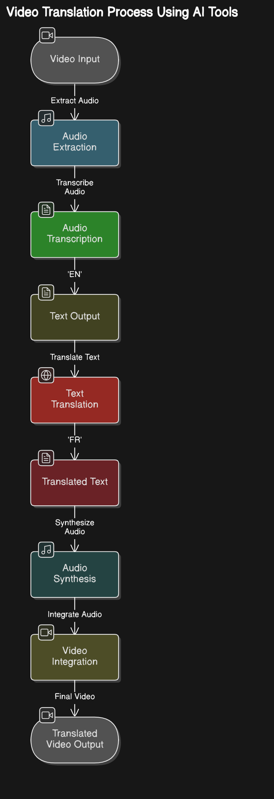

# Video Translation Project

## Introduction
Ce projet vise à traduire des vidéos en utilisant des outils d’IA avancés comme Whisper, MarianMT, et TTS. L’objectif initial était de créer une extension de navigateur qui permettrait aux utilisateurs de traduire automatiquement les vidéos qu'ils visionnent en ligne. Bien que ce projet soit encore en cours de développement, le POC (Proof of Concept) actuel est capable de traduire des vidéos MP4 locales avec un pipeline complet allant de la transcription à la génération de la vidéo traduite.

---

## Objectif Initial

L’idée initiale était de créer une extension de navigateur (comme Chrome ou Firefox) permettant de traduire automatiquement les vidéos regardées en ligne. L’extension aurait dû :

- Détecter la vidéo en cours de lecture sur une page Web.
- Extraire l'audio, le transcrire et le traduire en temps quasi réel.
- Générer un nouvel audio traduit et le superposer à la vidéo d’origine.

Cette ambition reste un futur développement, mais le POC actuel offre une base solide pour progresser vers cet objectif.

---

## Processus de Traduction Vidéo

Le diagramme ci-dessous illustre le processus complet de traduction d’une vidéo à l'aide des outils IA :

### Description des étapes :

1. **Entrée de la vidéo :** L'utilisateur fournit une vidéo MP4 comme entrée.
2. **Extraction de l'audio :** L'audio est extrait de la vidéo source pour être traité.
3. **Transcription de l'audio :** L'audio est transcrit en texte à l'aide du modèle Whisper.
4. **Traduction du texte :** Le texte transcrit est traduit dans la langue cible en utilisant MarianMT.
5. **Synthèse vocale :** Le texte traduit est converti en audio dans la langue cible avec TTS.
6. **Intégration audio :** L’audio traduit est superposé à la vidéo d’origine pour créer une nouvelle vidéo.
7. **Sortie finale :** L'utilisateur peut télécharger la vidéo traduite ou l'audio uniquement.

---

## Code Actuel

Le code est composé des éléments suivants :

1. **Transcription avec Whisper** :
   - Modèle utilisé : Whisper ("medium").
   - Fonction : `transcribe_audio(video_path)`.

2. **Traduction avec MarianMT** :
   - Fonction : `translate_text(text, src_lang, tgt_lang)`.

3. **Synthèse vocale avec TTS** :
   - Modèles utilisés selon la langue cible.
   - Fonction : `generate_audio(text, language, output_path)`.

4. **Intégration audio dans la vidéo** :
   - Fonction : `replace_audio_in_video(video_path, audio_path, output_path)`.

5. **Pipeline principal** :
   - Fonction : `process_video(video_path, src_lang, tgt_lang, output_video_path, output_audio_path=None)`.

---

## Idées d'Amélioration

Voici quelques idées pour améliorer le projet actuel :

1. **Amélioration des voix synthétiques :**
   - Utiliser des modèles plus avancés comme Parler-TTS pour un rendu vocal plus naturel.
   - Ajouter des options pour ajuster le genre et le ton de la voix.

2. **Interface utilisateur :**
   - Ajouter une barre de progression et des notifications pour chaque étape du traitement.
   - Permettre à l'utilisateur de prévisualiser le texte traduit avant la synthèse vocale.

3. **Support pour plus de langues :**
   - Ajouter des modèles TTS et MarianMT pour couvrir davantage de langues.

4. **Optimisation des performances :**
   - Activer l’accélération GPU pour Whisper et TTS.
   - Rendre le traitement parallèle pour réduire le temps de traitement.

5. **Extension navigateur :**
   - Rendre le projet compatible avec une extension de navigateur pour traduire des vidéos en ligne en temps réel.

6. **Monétisation :**
   - Proposer un service cloud où les utilisateurs peuvent uploader leurs vidéos et recevoir les versions traduites.

---

## Conclusion

Ce projet est une étape importante pour révolutionner la manière dont les contenus vidéo sont consommés à travers différentes langues. Bien qu’il reste encore des améliorations à apporter, le pipeline actuel offre une solution fonctionnelle pour la traduction de vidéos locales.

---

